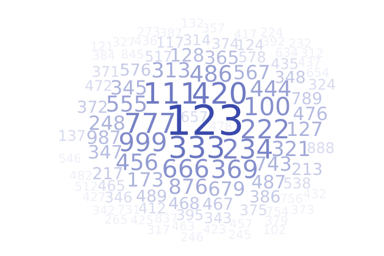

```{r setup, include=FALSE}
knitr::opts_chunk$set(echo = TRUE)
```

# Learning Objectives

## Statistical Learning Objectives
1. Understand how to translate a real data scenario into a simulation setup
1. Explore sample-to-sample variability by observing a distribution of simulated p-hat values.

## R Learning Objectives
1. Learn about reproducible randomness by "setting seeds"
1. Understand the basics of simulation in R

## Functions covered in this lab
1. `c()`
1. `rep()`
1. `set.seed()`
1. `sample()`
1. `replicate()`

# Weekly Advice
This week, we're working with randomness. This means that with some of this work, your mileage may vary -- you might get different answers than your peers. We'll learn a technique to make sure that when you knit your document, you get the *same* results as everyone else. **Make sure that you hit the "Run All Chunks Above" button** before the play button when you're running code!
<hr />

# Lab Tutorial

## Vectors
A *vector* is a way to hold a collection of items in R. Think of a vector like a weekly pill organizer: it has "slots" for you to store multiple things in and to carry them around. We've actually seen vectors before: the way to create one is to use the `c()` function, where `c` stands for `c`ombine.

We've specifically seen vectors in applying multiple colors or plotting characters (`pch`) to plots: we've used code like `col = c("red", "blue", "green")` or `pch = c(0, 1, 2)`. You can put real numbers, integers, characters, or even `TRUE`/`FALSE` values together into a vector: the only catch is they all have to be the same type of thing. No mixing and matching numbers and text! Here are some examples:

```{r charVec}
x <- c("hi", "this is", "a character vector.")
x
```
Notice this uses the `c()` function to `c`ombine the elements into a vector, which we call `x`.

```{r numVec}
y <- c(3, 5.6, 1, -7.2)
y
```

```{r mixedVec}
z <- c("Let's see", "what happens if", "we mix numbers and characters", 1, 5, 6)
z
```

See how "1", "5", and "6" are in quotes in that last one? They were forced to be text because you can't mix numbers and text in the same vector.

## Example 1: Homework 4, Question 5

Let's revisit question 5 on Homework 4, this time learning how to perform the simulations ourselves in R.

:::{.background}
Lee is a teacher at a local high school who wanted to assess whether or not dogs physically resemble their owners enough for people to be able to correctly match a dog to their owner better than if just guessing. Lee, who is also a dog owner, showed pictures of two dogs to her class of 26 students. One photo was of the teacher's dog (Yoda) and the other photo was of a dog the teacher had never met. The students were asked to guess which dog was actually the teacher's. If dogs do not physically resemble their owners, the students would get a correct match with probability 0.50. It turned out that 24 of the 26 students correctly picked out the teacher's dog. 
:::

:::{.question}
What is $\hat{p}$, the observed (sample) proportion of correct guesses?
:::

:::{.answer}
$\hat{p} = $
:::

:::{.question}
**Part (a):** What are the hypotheses to be tested? State the hypotheses as a sentence (no symbols). You'll want to define both H_0 and H_a.
:::

:::{.answer}
H_0: 

H_a: 
:::

:::{.question}
**Part (b):** Assuming that the students were just guessing, a blue poker chip will represent a correct guess and a yellow poker chip will represent an incorrect guess. If we want to use 100 poker chips out of convenience, how many blue chips and how many yellow chips should we designate?
:::

:::{.answer}
*Number of blue chips:*

*Number of yellow chips:* 
:::

## Repetition using `rep()`

Let's make a vector to represent the bag of poker chips we'll be drawing from. We'll call this vector `bagOfChips` (sadly, it's inedible). We could do this in one of two ways. We could call `c()` and fill it with 50 `"blue"`s and 50 `"yellow"`s, or we can use a function called `rep()`.

`rep()` takes two arguments: the first is what you want to `rep`eat and the second is the number of times you want it repeated. So I can make a vector that contains four copies of the string `"blue"` like this:

```{r rep-blue}
b <- rep("blue", 4)
b
```

We can also use `c()` to `c`ombine multiple `rep`s into one vector!
```{r rep-c}
bagOfChips <- c(rep("blue", 50), rep("yellow", 50))
head(bagOfChips)
table(bagOfChips)
```

:::{.question}
**Part (c):** Now that we have the poker chip allocation taken care of, we want to complete one repetition of the simulation. We will take our assigned poker chips and shuffle them inside of a bag. Based on the results of the study, how many poker chips should we draw from the bag to complete one repetition of the simulation?
:::

:::{.answer}
*Number of poker chips to draw:* 
:::

## Pseudo-Random Numbers
It turns out that humans are very bad at generating numbers randomly. Take a look at this word cloud of results from the STATS 250 Student Survey, in which you were asked to provide a random three-digit number. The larger a number is, the more often it showed up in the data.



As you can see, people tended to choose 123 a lot, or just typed the same number three times. If these numbers were *truly* random, we'd wouldn't see this -- we'd see most three digit numbers in the data, and each would appear only a few times. 

Computers are *much* better at randomness than humans are, but they're actually still quite bad. "Random" numbers generated by computers are meant to *look* and *seem* random, but, the sequences of numbers they generate are completely predictable if you know where that sequence starts. That starting point is called a **seed**. 

Think of the seed as, well, a seed: if you know what kind of seed you plant, you know exactly what kind of flowers will grow. By setting a seed, you can predict the exact sequence of "random" numbers that will grow from it.

You can choose the seed that your R session will use with a function called `set.seed()`. It's easier to see what this means in practice:

```{r seed}
set.seed(8362)
# 8362 is completely arbitrary. If you and your friend both set the same seed,
# you'll get the same sequence of "random" numbers. Nothing will print to the
# console in this chunk.
```

```{r randomNumbers}
# Let's generate 3 random numbers:
rnorm(3)
```

Every time you run the `randomNumbers` chunk above, you'll get 3 different numbers. But, if you run the `seed` chunk and then `randomNumbers` immediately after, you'll always get -1.13146971, -0.09216967, and -0.26140560.

You only need to set the seed **once** per document.

:::{.question}
**Part (d):** Should we pick poker chips from the bag with replacement or without replacement? Briefly explain why.
:::

:::{.answer}

:::

## Taking a `sample()`

So now we want to draw 26 poker chips from our `bagOfChips`. We'll do that using the `sample()` function.

```{r sample}
# Be sure to run all chunks above before running this chunk to reset the
# pseudorandom number sequence - this will make sure you get the same answers
# every time!

repetition1 <- sample(bagOfChips, size = 26, replace = TRUE)
```

Some things to note:

- The first argument to `sample()` is the object you want to sample from. In our case, it's our vector of 50 `"blue"`s and 50 `"yellow"`s. 
- The second argument, called `size`, is the number of draws you want from the object you're sampling from (here, `bagOfChips`). 
- Last, we can specify whether we want to sample with replacement (`replace = TRUE`) or without replacement (`replace = FALSE`). It's *very* important that `TRUE` and `FALSE` are all uppercase.

Let's see what our sample came out to be by making a frequency table:

```{r sampleTable}
table(repetition1)
```

We can also count just the number of blue chips using our old friend `==` (logical equals) and the `sum()` function:

```{r countBlues}
# add up the number of times an entry in repetition1 is exactly equal to "blue"
numBlues <- sum(repetition1 == "blue")
numBlues
```

Dividing by 26 to get the proportion of blue chips, we get

```{r propnBlues}
numBlues / 26
```


## Do It Again: `replicate()`

So we've got one repetition of our simulation experiment, and got 61.5% blue chips. Let's do it again and again and again, 100 times. We can do this easily with `replicate()`.

```{r replicateExample}
simulationResults <- replicate(100, {
  draw <- sample(bagOfChips, size = 26, replace = TRUE)
  sum(draw == "blue") / 26
})
```

Let's unpack this code a bit. The `replicate()` function will run the code that's in the curly braces `{}` 100 times (or however many times we specify in the first argument). This is **different from `rep()`**! `rep()` is copy/paste: it just repeats what you give it a bunch of times. `replicate()` re-runs code, so we'll get different results every time. If you use `rep()`, you'll just get the same number over and over again.

Inside the curly braces in `replicate()`, we draw a sample of size 26 with replacement from `bagOfChips` and call the resulting sample `draw`. Then, we count how many of the chips were `"blue"` and divide by 26 to get the proportion of blue chips.

Let's make a histogram of our results, and draw a vertical line at our observed p-hat of 24/26 = 92.3%.

```{r histQ4}
hist(simulationResults, 
     main = "Histogram of 100 Simulation Results",
     xlab = "Simulated Proportion of Correct Guesses",
     xlim = c(0, 1)) # The xlim argument sets the limits of the x-axis. It gets a vector!

# Draw a (v)ertical line at 24/26 on top of the histogram
abline(v = 24/26, col = "red")
```

To wrap up, let's compute the **p-value**, the proportion of simulations giving a result as extreme or more extreme than what we observed. Note that the full definition of the p-value is the probability of observing a value as extreme or more extreme than what we observed, assuming the null hypothesis is true. We ran our simulations under the null model (i.e., assuming the null is true), so we can just count the number of results as extreme or more extreme than our observation.

Our alternative hypothesis is that the probability of a correct guess is *higher* than 50%, so "as extreme or more extreme" means *greater than* our observed value. Let's find the proportion of simulations that gave a proportion of correct guesses greater than or equal to 24/26.

```{r example1pval}
sum(simulationResults >= 24 / 26) / 100
```

None of the simulations gave a value as extreme or more extreme than 24/26, so the p-value is 0.

So, we'll conclude that we have very strong evidence against the null hypothesis: the observed proportion is unusual when compared to the simulated proportions.

## Example 2: Homework 4, Question 6

:::{.background}
Detroit Metro Airport (DTW) claims that between August 2015 and August 2016, inclusively, 85.5% of all tracked flights departed the airport on time (with less than 15 minutes delay). With a decrease in the number of daily flights, a news reporter begins to analyze data from 2020.
:::

:::{.question}
**Part (a):** The reporter reasons that because there were fewer daily flights in 2020, Detroit Metro Airport's efficiency should have increased. What are the hypotheses to be tested? State the hypotheses as a sentence (no symbols). You'll want to define both H0 and Ha.
:::

:::{.answer}
H_0: 

H_a: 
:::

:::{.question}
**Part (b):** The reporter randomly samples 44 flights from the year 2020, and 40 reported an on time departure at DTW (with less than 15 minutes delay). What is the sampled proporton of on time flight departures from the year 2020 at DTW? Include the symbol and the value.
:::

:::{.answer}

:::

### Running the Simulation

Set up our bag of chips. Suppose we have 1000 poker chips. Allocate the correct number of blue and yellow chips.

```{r ex2Chips, error = TRUE}
bagOfChips <- c(rep("blue", X), rep("yellow", Y))
```

Now we'll use `replicate()` to sample from `bagOfChips` 100 times.

```{r ex2simulation, error = T}
simulationResults2 <- replicate(100, {
  draw <- sample(bagOfChips, size = Z, replace = TRUE)
  sum(draw == "blue") / Z
})
```

Make a histogram of the results with a vertical line at our observed value:

```{r ex2hist, error = T}
hist(simulationResults2,  
     main = "Histogram of 100 Simulation Results",
     xlab = "Simulated Proportion of On-Time Flight Departures",
     xlim = c(0, 1)) # The xlim argument sets the limits of the x-axis. It gets a vector!

abline(v = 40 / 44, col = "red")
```

Estimate the p-value:

```{r ex2pval, error = T}
sum(simulationResults2 >= 40 / 44) / 100
```

:::{.question}
**Part (e):** Are our results unusual if the null hypothesis is true? 
:::

:::{.answer}

:::

# Code Cheat Sheet

## `c(...)`
- `...` is a comma-separated list of objects to be combined into a vector. These can be numbers, text/"strings", etc., but they all need to be the same kind of thing.

## `rep(x, times)`
Makes a vector consisting of `x` copy/pasted `times` times

- `x` is the thing you want `rep`eated
- `times` is the number of times you want to `rep`eat `x`

## `set.seed(seed)`
Sets the "seed" of R's random number generator. After setting the seed, the sequence of random numbers R will produce is entirely determined/predictable. This is useful for ensuring you get the same results whenever you knit your code.

- `seed` is an integer. The seed you want to set.

## `sample(x, size, replace = FALSE)`
Takes a sample of the specified size from the elements of `x` using either with or without replacement.

- `x` is a vector of elements to sample from
- `size` is a non-negative integer giving the number of items to choose from `x`
- `replace` should be `TRUE` if you want to sample with replacement; defaults to `FALSE` to sample without replacement

## `replicate(n, expr)`
Runs the code in `expr` `n` times and reports the results. *NOT* the same as `rep()` - `replicate()` re-runs code; `rep()` copies and pastes the result of one run of the code.

- `n` is the number of times to run the code in `expr`
- `expr` is an "expression" -- basically a block of code contained in curly braces {} that you want to run `n` times.
